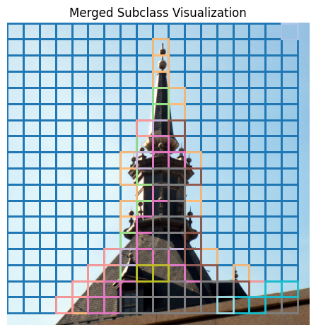
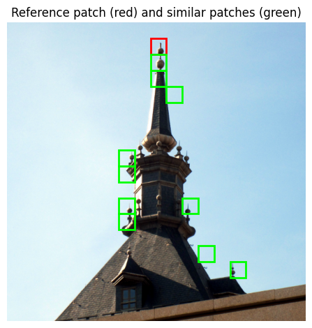
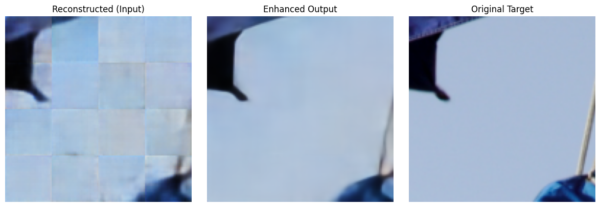

# Subclass-Aware Image Compression

## Overview

Traditional learned image compression systems using Variational Autoencoders (VAEs) often assume a global prior, typically a unit Gaussian, over the latent representations of image patches. However, natural images are highly diverse — smooth regions, edges, textures, and patterns each exhibit very different statistics.
Using a single shared prior for all latent codes introduces a mismatch: the latent distributions for semantically different patches are forced to fit the same prior, resulting in poor compression efficiency and high KL divergence.
This project proposes a subclass-aware latent prior modeling framework that explicitly addresses this mismatch. By discovering semantic subclasses in latent space and assigning a dedicated prior to each subclass, the system improves both entropy coding efficiency and reconstruction fidelity.

## Patch-wise VAE Encoder
The image is divided into 32×32 non-overlapping patches, each of which is passed through a convolutional VAE. The VAE is trained with additive uniform noise to simulate quantization during training. During inference, the latents are quantized by rounding.

This patch-based approach allows fine-grained compression and supports spatially adaptive modeling.

### 📐 Model Architecture

```text
Input: x ∈ ℝ[B, 3, 32, 32]
│
├── Encoder
│   ├── Conv2d: 3 → 32    (4×4, stride=2, padding=1)     → 16×16
│   ├── ReLU
│   ├── Conv2d: 32 → 64   (4×4, stride=2, padding=1)     → 8×8
│   ├── ReLU
│   ├── Conv2d: 64 → 128  (4×4, stride=2, padding=1)     → 4×4
│   ├── ReLU
│   ├── Conv2d: 128 → 128 (3×3, stride=1, padding=1)     → 4×4
│   └── ReLU
│
├── Latent Heads
│   ├── conv_mu:      128 → latent_channels (1×1)
│   ├── conv_logvar:  128 → latent_channels (1×1)
│   └── z = μ + σ·ε  (Reparameterization Trick)
│
├── Quantization
│   ├── Training:  z + U(-0.5, 0.5)
│   └── Inference: round(z)
│
├── Decoder
│   ├── ConvT: latent_channels → 128 (3×3, stride=1)     → 4×4
│   ├── ReLU
│   ├── ConvT: 128 → 64   (4×4, stride=2, padding=1)     → 8×8
│   ├── ReLU
│   ├── ConvT: 64 → 32    (4×4, stride=2, padding=1)     → 16×16
│   ├── ReLU
│   ├── ConvT: 32 → 3     (4×4, stride=2, padding=1)     → 32×32
│   └── Sigmoid (output in [0, 1])
│
Output: Reconstructed patch (ℝ[B, 3, 32, 32]), μ, logσ², ẑ
```

Just the encoder is used for the patches along with the quantization.


---------------------------------------------------------------------------------- 

## Latent Subclass Assignment Network (SimCLR-based)
To group similar latents into semantic subclasses, the unquantized latent tensors are projected into a lower-dimensional space using a LatentSimCLRProjection network — a shallow ConvNet followed by a projection MLP.

Using a SimCLR-style contrastive learning loss, this network encourages similar latent tensors (from similar patches) to cluster together in the embedding space. These clusters form the basis of subclass-aware prior modeling.

This design choice — using unquantized latents for subclass assignment — ensures that the clustering is done on clean, information-rich representations, rather than noisy quantized ones.

### 📐 Model Architecture

```text
LatentSimCLRProjection

Input: z ∈ ℝ[B, 64, 4, 4] or [B, 64, H, W]
│
├── Backbone Feature Extractor
│   ├── Conv2d: 64 → 128 (3×3, stride=1, padding=1)     → [B, 128, H, W]
│   ├── ReLU
│   ├── Conv2d: 128 → 256 (3×3, stride=1, padding=1)    → [B, 256, H, W]
│   ├── ReLU
│   ├── AdaptiveAvgPool2d(1×1)                          → [B, 256, 1, 1]
│   └── Flatten                                         → [B, 256]
│
├── Projection Head
│   ├── Linear: 256 → 256
│   ├── ReLU
│   ├── Linear: 256 → proj_dim (default: 128)           → [B, 128]
│   └── L2 Normalization                                → [B, 128]
│
Output: ℓ2-normalized projection vector (for contrastive loss)
```




----------------------------------------------------------------------------------------


## Subclass-Aware Entropy Coding (Planned)
Once each patch latent is assigned to a subclass, a separate prior distribution is learned or modeled for each subclass. These subclass priors can be either:

Parametric (e.g., Gaussian with learned mean and variance per component thus - Component Aware Prior Modeling)

At inference time, each quantized latent tensor is entropy-coded using its corresponding subclass prior. This leads to more accurate coding and reduced bit rates, as the prior more closely matches the true posterior for that subclass.

This is currently planned as the next step of the project.


--------------------------------------------------------------------------------------


## Decoder + Patch Stitching
Each quantized latent is decoded using the VAE decoder to reconstruct its 32×32 patch. These patches are then stitched together in raster scan order to reconstruct the full image.


---------------------------------------------------------------------------------------

## Enhancement Network (Attention UNet)
To further improve perceptual quality and reduce stitching artifacts, a UNet-style enhancement network is trained. The network takes the stitched image (128×128 resolution in your case) and produces a refined output.

The enhancement network uses attention gates on skip connections to selectively attend to relevant encoder features. This improves feature fusion during decoding, and significantly boosts the PSNR by 2–4 dB post-processing.

### 📐 Model Architecture

```text
Input: 128×128×3 image
│
├── Encoder
│   ├── ConvBlock1: 3 → 64         → Output: 128×128×64
│   ├── MaxPool                    ↓
│   ├── ConvBlock2: 64 → 128       → Output: 64×64×128
│   ├── MaxPool                    ↓
│   └── ConvBlock3: 128 → 256      → Output: 32×32×256
│       ↓
│
├── Bottleneck
│   └── ConvBlock: 256 → 512       → Output: 16×16×512
│       ↓
│
├── Decoder with Attention
│   ├── UpConv: 512 → 256          → Output: 32×32×256
│   ├── AttentionBlock(256, 256)   → Applies attention between decoder and encoder feature maps
│   ├── Concat([attended e3, up3]) → 512 channels
│   ├── ConvBlock: 512 → 256       → Output: 32×32×256
│
│   ├── UpConv: 256 → 128          → Output: 64×64×128
│   ├── AttentionBlock(128, 128)
│   ├── Concat([attended e2, up2]) → 256 channels
│   ├── ConvBlock: 256 → 128       → Output: 64×64×128
│
│   ├── UpConv: 128 → 64           → Output: 128×128×64
│   ├── AttentionBlock(64, 64)
│   ├── Concat([attended e1, up1]) → 128 channels
│   ├── ConvBlock: 128 → 64        → Output: 128×128×64
│
└── Output
    └── Conv2d: 64 → 3             → Output: 128×128×3
    └── Sigmoid                    → Final Enhanced Image
```


---------------------------------------------------------------------------

## Summary of the Full Pipeline

### Input Image is split into 32×32 patches.
### Each patch is encoded by the Patch VAE → latent tensor z.
### Unquantized z is projected using LatentSimCLRProjection to assign a subclass.
### Quantized z (via noise or rounding) is passed to:
### Entropy coder (planned), using subclass-aware prior.
### VAE decoder to reconstruct the patch.
### Reconstructed patches are stitched back.
### Final image is passed through the Attention UNet Enhancer.
### Output: high-quality reconstruction with >32 dB PSNR.
